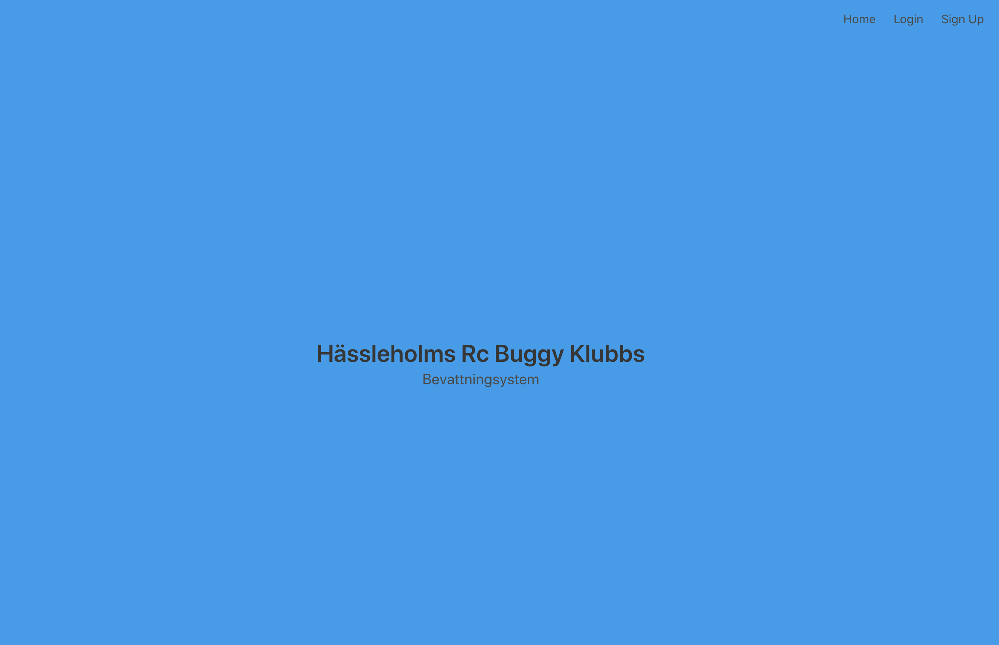

# Automated watersystem HRCBK for a RaspberryPi
 

## Installation

1. Clone this repository: `git clone https://github.com/VGDev1/watersystem`
2. Change directory: `cd watersystem`
2. Install the requirments: `pip3 install -r requirments.txt`
3. `export FLASK_APP=project`
The FLASK_APP environment variable instructs Flask how to load the app. It should point to where create_app is located. For our needs, we will be pointing to the project directory.

4. `export FLASK_DEBUG=1` 
The FLASK_DEBUG environment variable is enabled by setting it to 1. This will enable a debugger that will display application errors in the browser.

## Requirments
- Python3

## Run
`flask run` in the project directory

## Account 
Use demo account with email: "info@hrck.se" and password: "password"

